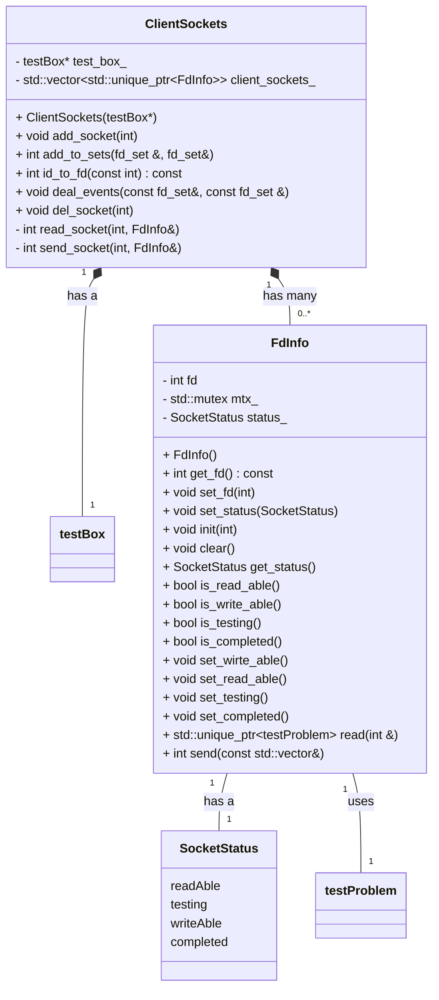

处理客户端连接

每一次client socket连接建立的时候，会调用`testBox->getTestBoxId()`来获取一个唯一的id,这个id会随着连接的关闭而失效(即连接断开后,id会被回收).

这个id可以用来区分不同的client,比如在同一个testBox中,可以通过id来区分不同的client,从而实现不同的功能.

client就是通过这个id来进行通信的，从而实现发现评测数据，获取评测结果。

一个client 的生命周期内，它的id是**固定的**。




## 事件循环

这里详细的解释一下事件循环的流程与FdInfo的各个状态的转变。


```
main 循环
```