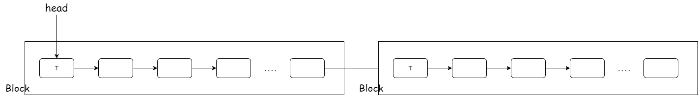
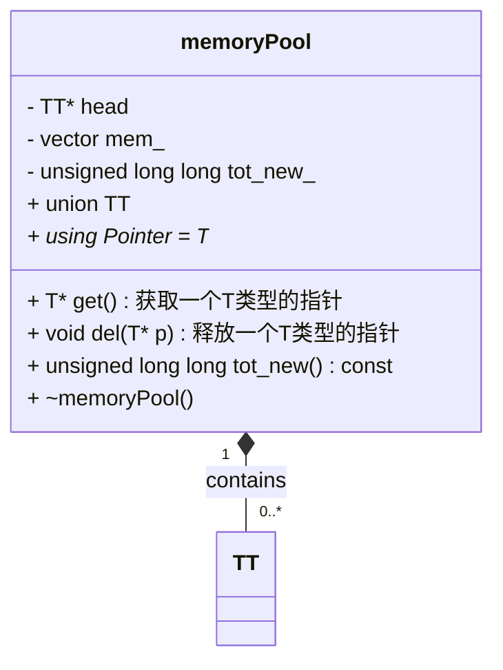

## 整体流程

## testBox

testBox 测试盒子,接收测试数据,返回测试结果

- dataSizeLimit: 传递过来的一个测试数据(testProblem类型),算是一个Data,dataSizeLimit表示可以同时处理的Data数量

API

testBox 是全局唯一的(singleton),通过调用testBox的方法,来实现评测功能

## client_socket.h

处理客户端连接

每一次client socket连接建立的时候，会调用`testBox->getTestBoxId()`来获取一个唯一的id,这个id会随着连接的关闭而失效(即连接断开后,id会被回收).

这个id可以用来区分不同的client,比如在同一个testBox中,可以通过id来区分不同的client,从而实现不同的功能.

client就是通过这个id来进行通信的，从而实现发现评测数据，获取评测结果。

一个client 的生命周期内，它的id是**固定的**。

包含两个重要的类

1. `clientSockets`
2. `FdInfo`

fdIinfo 是用来存储并管理 fd 值的结构体。它的核心设计是一个**状态机**，通过一个`状态码status`来表示当前的状态，从而实现不同的功能。

## [memoryPool](../include/memoryPool.h)

块状内存池,特点: 

1. 每次可以申请一块固定大小(`memPool<int>`申请`int`大小)内存,大小为`memPool<T>`中变量`T`的大小
2. 内存池的内存是线程安全的,可以在多线程环境下使用

如图所示:

## [resultContainer](../include/resultContainer.h)

内容比较多，见[resultContainer.md](./resultContainer.md)