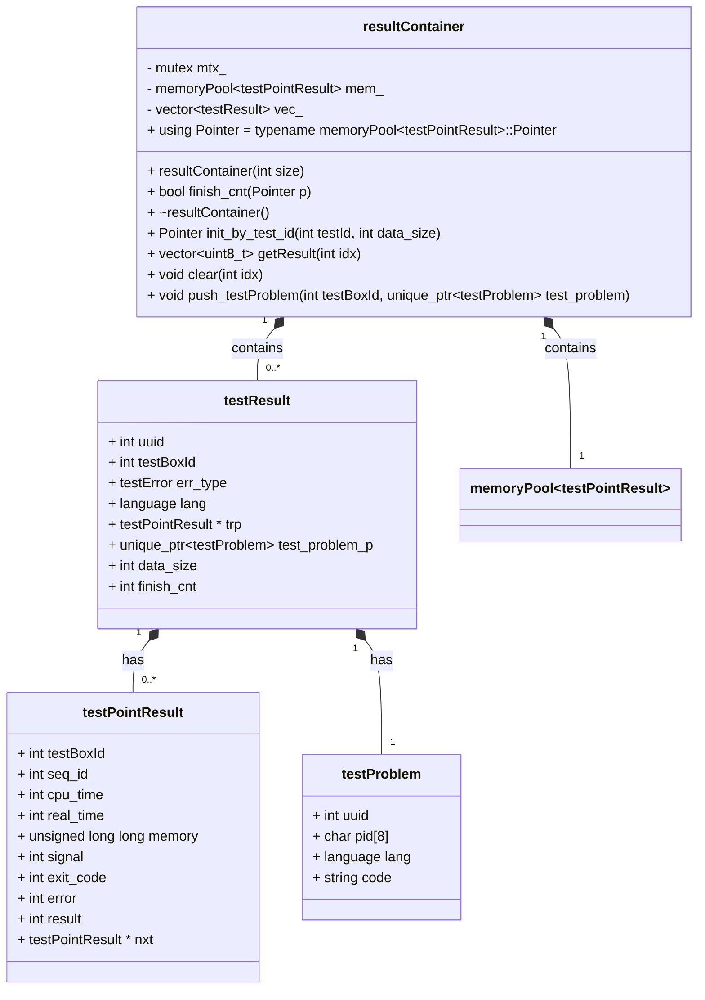

# [resultContainer](../include/resultContainer.h)

存[testPointResult](../include/judgeInfo.h)的容器

结构图如下

`resultContainer` 类主要用于管理和存储评测结果相关的数据，它借助内存池和向量(vec)来高效处理和组织这些数据。以下是该类的主要作用：

### 1. 初始化和资源管理

- 在构造函数 `resultContainer(int size)` 中，会根据传入的大小对向量 vec_ 进行调整，并将每个 `testResult` 元素中的 trp 指针初始化为 `nullptr`。
- 析构函数 `~resultContainer()` 会释放所有存储的 `testPointResult` 链表节点所占用的内存，确保资源的正确释放。

### 2. 内存管理

- 利用 `memoryPool<testPointResult> mem_` 内存池来管理 `testPointResult` 对象的内存分配和释放，避免频繁的内存分配和释放操作，从而提高性能。

### 3. 测试结果管理

- `init_by_test_id(int testId, int data_size)` 方法会为指定的 testId 一次性分配所需数量的 `testPointResult` 对象，并将其组织成链表，最后返回链表的头部指针。
- `finish_cnt(Pointer p)` 方法会对指定 testBoxId 对应的测试完成计数进行更新，若完成的测试点数量达到数据大小，则返回 true。
- `clear(int idx)` 方法会移除指定 idx 对应的所有 `testPointResult` 节点，并将这些节点的内存归还给内存池。

### 4. 数据存储和访问

- `push_testProblem(int testBoxId, std::unique_ptr<testProblem> test_problem)` 方法将 `testProblem` 对象移动到对应的 testBoxId 中。
- `getResult(int idx)` 方法从 resultContainer_ 中读取数据，并返回序列化后的 `testResultWithVecotr` 数据。

### 数据的读取

数据读取不会重复的读取数据: `read_cnt`记录了上次读取数据(评测完成数据点的结果)的数量,只有`read_cnt < finish_cnt`时,才会读取数据,否则会返回空向量和一个`no_new`的`status`.这样设计可以避免`fdInfo`重复读取然后发送重复的数据,提高效率.

### 总结

`resultContainer` 类的核心作用是高效地管理和存储评测结果数据，通过内存池和链表结构，它实现了对 `testPointResult` 对象的内存管理，同时提供了对测试结果的初始化、计数、移除和数据存储等操作。

### 类关系图

## 解释一下类

### testResult
testResult 类表示一个测试结果，包含以下成员变量：
- `uuid`：测试结果的唯一标识符。
- `testBoxId`：测试结果所属的测试盒子的 ID。
- `err_type`：测试结果的错误类型。
- `lang`：测试结果的语言。
- `trp`：指向测试点结果链表的头指针。
- `test_problem_p`：指向测试问题的智能指针。
- `data_size`：测试数据的大小。
- `finish_cnt`：已完成的测试点数量。

### testPointResult

testPointResult 类表示一个测试点结果，包含以下成员变量：
- `testBoxId`：测试结果所属的测试盒子的 ID。
- `seq_id`：测试点的序列号。
- `cpu_time`：测试点的 CPU 时间。
- `real_time`：测试点的真实时间。
- `memory`：测试点的内存使用量。
- `signal`：测试点的信号。
- `exit_code`：测试点的退出码。
- `error`：测试点的错误信息。
- `result`：测试点的结果。
- `nxt`：指向下一个测试点结果的指针。
