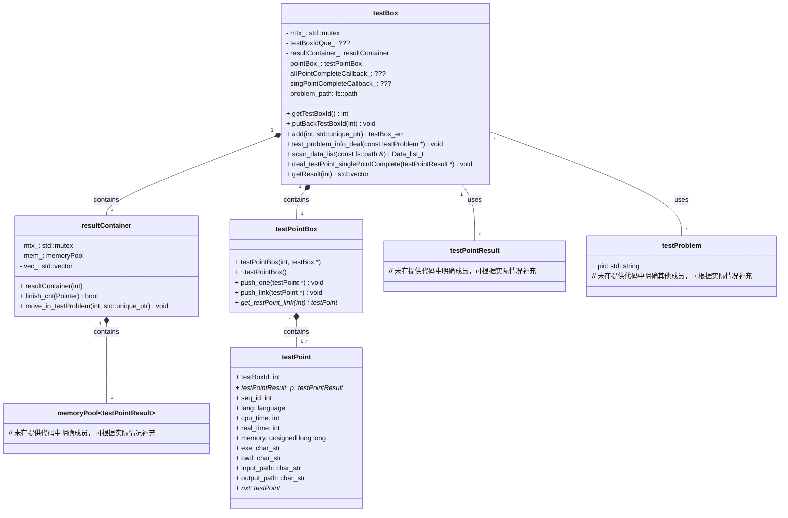
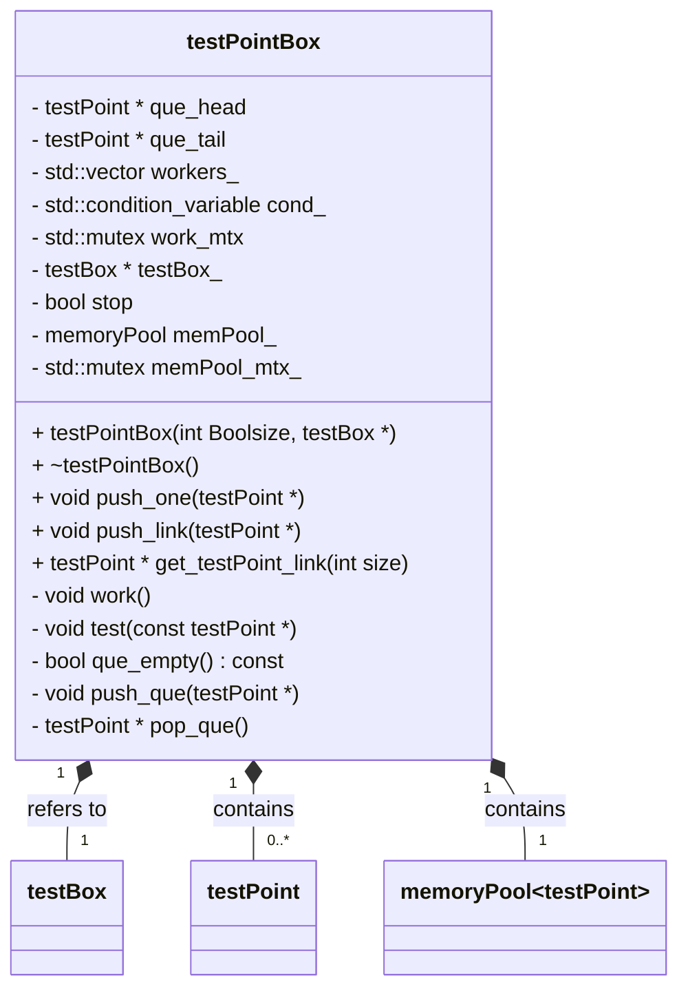

testBox 测试盒子,接收测试数据,返回测试结果

`testBox`作用： 
1. 接收测试数据`testProblem`
2. 根据`testProblem`生成一系列`testPoint`
2. 通过`testPointBox`处理测试数据`testPoint`
3. 通过`resultContainer`管理测试结果`testPointResult`

!!!! TODO testBox 如何与上层进行交互?

上层是client_sockets 写事件与读取事件

- client_sockets.deal_events -> read -> testBox.add -> 处理
- testBox->deal_testPoint_singlePointComplete -> allPointCompleteCallback -> FdInfo.set_complete()`哪里改的可写呢` 原来是client_sockets->add_to_sets
        !!!--> 调用 testBox->getResult(testBoxId)

- dataSizeLimit: 传递过来的一个测试数据(testProblem类型),算是一个Data,dataSizeLimit表示可以同时处理的Data数量

TODO client_sockets 与FDinfo
client_sockets 是一个状态机,通过FDinfo来管理状态,通过状态的转换来实现不同的功能，在状态转化中，会对resultContainer进行初始化

- 在评测结束后，client_sockets会调用testBox->getResult(testBoxId)来获取测试结果
- 最后一次发送数据后，client_sockets会调用testBox->clearResultByTestBoxId(testBoxId)来清除测试结果

## 类设计

类关系图如下：

## API

testBox 是全局唯一的(singleton),通过调用testBox的方法,来实现评测功能

## 解释

## 1. testBox

类`testBox`本质上`testPointBox`与`resultContainer`的组合`Wrapper`,负责管理`testPointBox`与`resultContainer`的初始化,以及提供`testPointBox`与`resultContainer`的接口.

1. testBox得到数据
2. testBox将处理数据,解析成Point类型的数据,交给testPointBox
3. testPointBox将Point类型的数量时行Judge,并将Judge的结果交给resultContainer
4. 外部通过testBox的接口,获取测试结果

## 2. testPointBox

`testPointBox`作用： 

1. 从上层`testBox`接收测试数据(testPoint类型)
2. 多线程评测测试点
3. 将测试结果写入`resultContainer`中
4. 通知`testBox`测试点完成

testPointBox的工作流程如下:

写入测试结果到 resultContainer 中

> 在`testPointBox`的函数`test`中,当测试点测试完成后,会调用`testPoint`指针`testPointResult_p`的成员函数`setResult`来设置测试结果.

## 3. resultContainer

`resultContainer`作用： 
1. 对测试结果进行管理,包括:
    1. 存储测试结果(testResult类型)
    2. 提供测试结果的查询与删除接口
2. 存储测试的状态,包括:
    1. idle: 空闲
    2. compiling: 正在编译
    3. testing: 正在评测
    4. finish: 评测完成,没有出错
    5. error: 评测出错
3. 提供测试结果的查询与删除接口
    1. `getResult(&status)`: 获取测试结果,并得到一个status
    2. clearResult: 清除测试结果
4. 可以多线程访问

见[resultContainer.md](./resultContainer.md)

resultContainer的工作流程如下:
TODO 在哪些位置被 调用