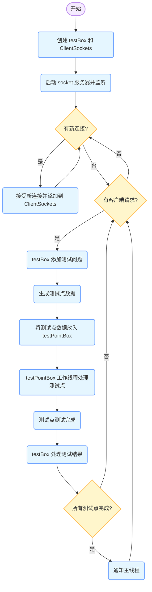

```mermaid
graph TB
    classDef startend fill:#F5EBFF,stroke:#BE8FED,stroke-width:2px;
    classDef process fill:#E5F6FF,stroke:#73A6FF,stroke-width:2px;
    classDef decision fill:#FFF6CC,stroke:#FFBC52,stroke-width:2px;

    A([开始]):::startend --> B(创建 testBox 和 ClientSockets):::process
    B --> C(启动 socket 服务器并监听):::process
    C --> D{有新连接?}:::decision
    D -- 是 --> E(接受新连接并添加到 ClientSockets):::process
    E --> D
    D -- 否 --> F{有客户端请求?}:::decision
    F -- 是 --> G(testBox 添加测试问题):::process
    G --> H(生成测试点数据):::process
    H --> I(将测试点数据放入 testPointBox):::process
    I --> J(testPointBox 工作线程处理测试点):::process
    J --> K(测试点测试完成):::process
    K --> L(testBox 处理测试结果):::process
    L --> M{所有测试点完成?}:::decision
    M -- 是 --> N(通知主线程):::process
    N --> F
    M -- 否 --> F
    F -- 否 --> D
```